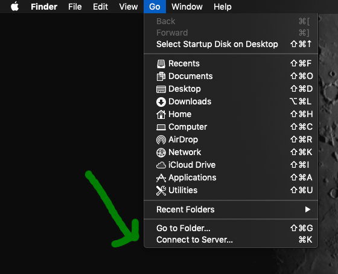

# How to use the YODA research data management tool 
YODA is a web interface developped by the Utrecht University 
to manage data and metadata that are handled via the [iRODS system](https://irods.org/). 

To learn more about YODA, please go to: https://yoda.sites.uu.nl/home/introduction-to-yoda-2/

## Table of contents
1. [How to upload files to YODA (local mount)](#how-to-upload-files-to-yoda-local-mount)
2. [How to add metadata on your datasets (YODA website)](#how-to-add-metadata-on-your-datasets-yoda-website)
3. [Reference](#reference)

# Important links
YODA user guide (Utrecht University): https://yoda.sites.uu.nl/  
YODA instance of the UvA (pilot phase): https://uva-yoda.irodspoc-sara.surf-hosted.nl/ 

# How to upload files to YODA (local mount)

### Mounting YODA through Davrods on your machine.
To mount the YODA system on your local machine:
1. On Mac OS X, open the `Finder`, then select `Go` then `Connect to server`.
2. Enter the following link (Davrods interface of iRODS/YODA): `https://uva-data.irodspoc-sara.surf-hosted.nl` 
3. Enter your login and password.
4. You can now upload your desired files to iRODS through the DavRODS interface (appears as a volume on your machine).

Here are a few screenshots to guide you:  

### Organisation of the folders
Whenever you create a user group, this will create two folders: one prefixed with "research-" and one prefixed with "vault-".

You can make subfolders at your convenience. Metadata are managed at the folder level so every *data collection* is made up of one folder containing datasets + the associated metadata. 

# How to add metadata on your datasets (YODA website)
To do so, you'll need to access the YODA online portal through a web browser. You will be able to add or edit metadata related to your dataset. This will allow you to publish internally to the vault so that your datasets become read-only (cannot be modified anymore).

Link to the YODA instance of the UvA: https://uva-yoda.irodspoc-sara.surf-hosted.nl/    

Here's how the portal looks like:  

### YODA research
Please refer to the YODA user guide: https://yoda.sites.uu.nl/home/introduction-to-yoda-2/yoda-user-interfaces/research-module/

### Deposition of a data package in the Vault
This workflow makes sure that your datasets and their associated metadata moves to the safe part of the vault. It is only visible to users with permissions. 

### Publishing a data package
This allows you to publish a collection of datasets and their metadata to the outside world.

# Reference
[Smeele Ton & Westerhof Lazlo, 2018. Using iRODS to manage, share and publish research
data: Yoda. Proceedings of the iRODS User Group Meeting 2018](./2018-Yoda.pdf). A paper from the YODA project lead Ton Smeele  director.