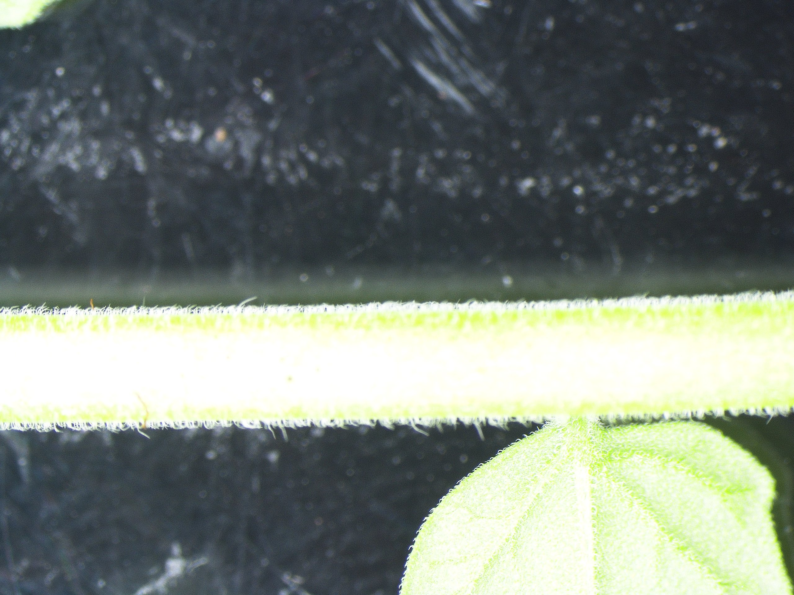
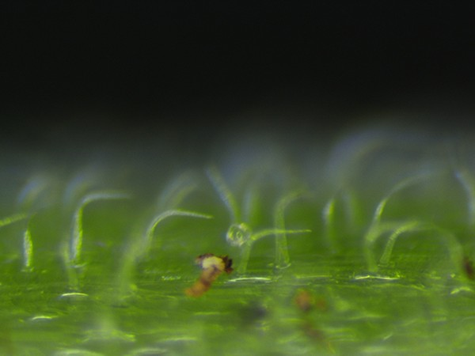
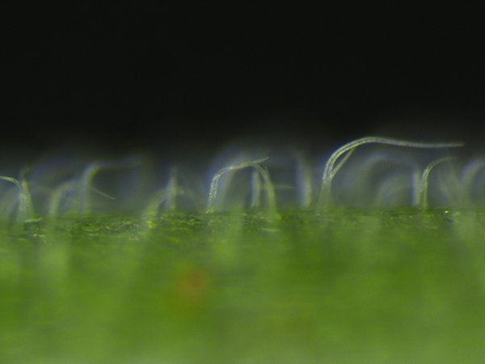

# Making high-quality pictures of tomato trichomes
This protocol is to take high-quality pictures of trichomes and stack them into one unique final picture.   
The stem from the 4th leaf from the top will be used to make a picture.   
  
This protocol is composed of two parts: 
- Firstly: take a series of pictures (15 to 30 pictures) using a stereomicroscope 
- Secondly: photo stacking using Photoshop 

# First part: taking pictures using the Leica MZFLII
1. Turn on the microscope zoom mechanism 
2. Turn on the ebq 100 lamp and the Olympus Highlight 2000 lamp
3. Make sure no filter (e.g. dsRed) is applied
4. Open the Nikon NIS-Elements program. 
5. Take a piece of stem and place it horizontally (---) under the microscope. . 
6. Zoom out completely. 
7. Zoom in at 10,000x on the side of the branch ("labeled 10.0 on the microscope).
8. Focus on a few trichomes. Get them as much as possible in focus. This is going to be your first picture (foreground).   
9. Zoom in about a few trichome layers away. There should not be too much overlap between the different trichomes (otherwise they get merged together during the stacking phase). This will be your background. 
10. Zoom out to go back to the foreground (= your first picture). 
11. Depending on the number of trichomes in-between your foreground and background, you need to take a variable number of pictures.  
    - If trichome density is high, then trichomes will overlap during the stacking meaning that you need to take more pictures (~30) and reduce the distance between your foreground and background.  
    - If trichome density is low, then trichomes won't overlap and you need less pictures (~10)

 Horizontal stem position  
  Foreground (step 8)  
  Background (step 9)

# Second part: alignment of pictures using Photoshop
See the [trichome layer photography](./trichome_layer_photography) protocol made by Maurice Heilijgers (August 2018).
